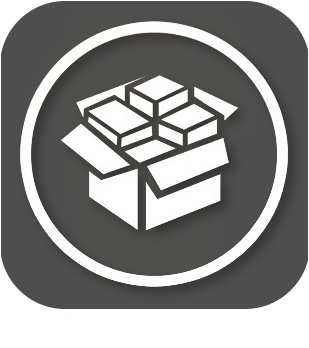
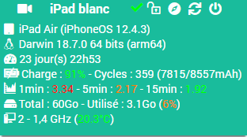

Plugin Jailbreak
=============

Plugin pour récépérer les informations et commander les équipements Apple.

> **Note**  
> Pour fonctionner, il faut installer le tweak OpenSSH sur l'appareil.

**Fonctionnalités :**

- Éteindre / redémarrer,
- affichage les informations de l'appareil,
- déverrouiller l'appareil,
- lancer des applications à distance.

**Modèles compatibles**
- iPad / iPhone.

Dashboard
=========

Configuration du plugin
=======================

Après téléchargement du plugin, activer le plugin.

Configuration des équipements
=============================

La configuration des équipements est accessible à partir du menu *Plugins > Monitoring > Jailbreak*.

### Onglet Equipement:

-   **Nom de l'équipement** : nom de votre équipement,
-   **Objet parent** : indique l’objet parent auquel appartient l’équipement,
-   **Catégorie** : les catégories de l’équipement (il peut appartenir à plusieurs catégories),
-   **Activer** : permet de rendre votre équipement actif,
-   **Visible** : rend votre équipement visible sur le dashboard,
-   **Adresse IP** : adresse IP de l'équipement,
-   **Port SSH** : port SSH de l'équipement (installer OpenSSH sur l'équipement),
-   **Identifiant** : identifiant SSH de l'équipement (par défaut : root),
-   **Mot de passe** : mot de passe associé à l'identifiant SSH de l'équipement (par défaut : alpine).

### Onglet Commandes

Les commandes sont générées automatiquement.

### Page Santé

La page Santé est accessible depuis la page de configuration des équipements.
Elle remonte les informations des équipement.

### Page Installation

La page Installation est accessible depuis la page de configuration des équipements.
Elle permet d'envoyer le fichier d'installation des dépendances des équipements. (tweaks et paquets dont le plugin a besoin)

### Liste des versions

*[Voir la liste des versions](changelog.md)*
