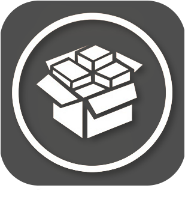
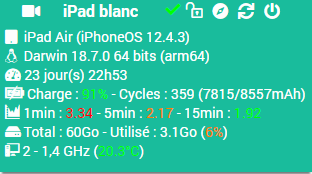

Plugin Optoma
=============

This plugin monitors and controls Apple's iPhone/iPad.

> **Note**  
> First, you need to install the tweak OpenSSH on your device.

**Functionality :**

- Turn on / turn off,
- display hardware informations,
- unlock the device,
- Launch apps remotely.

**Compatibility**
- All iPad/iPhone

Dashboard
=========

Plugin configuration
=======================

First download the plugin, then activate it.

Equipment configuration
=============================

Equipment configuration is accessible by Menu *Plugins > Monitoring > Jailbreak*.

### Tab Equipement:

- **Equipment name**: name of your equipment,
- **Parent object**: indicates the parent object to which the equipment belongs,
- **Category**: the categories of the equipment (it can belong to several categories),
- **Enable**: to make your equipment active,
- **Visible**: makes your equipment visible on the dashboard,
- **IP Address**: IP address of the equipment,
- **SSH Port Address**: SSH port of the equipment (install OpenSSH Tweak on device),
- **Login**: SSH login (default : root),
- **Password**: SSH password associated with the login (default : alpine).

### Tab Commandes

Commands are automatically created.

### Health Page

The Health page is accessible from the equipment configuration page.
It goes back to the equipment information.

### Installation Page

The Installation page is accessible from the equipment configuration page.
It allows you to send the equipment dependencies installation file. (tweaks and packages the plugin needs)

### Changelog

*[See changelog](changelog.md)*
