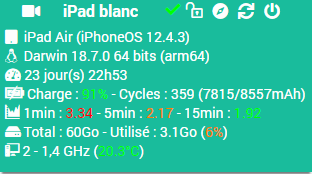

Plugin Jailbreak
=============

Plugin para leer las informaciones y el controla de los equipos Apple.

> **Nota**  
> Para operar, debe instalar Tweak OpenSSH en el dispositivo.

**Características :**

- Encender / apagar,
- mostrar información del dispositivo,
- desbloquear el dispositivo,
- Lanzar aplicaciones de forma remota.

**Modelos compatibles**
- iPad / iPhone.

Dashboard
=========

Configuración de plugin
=======================

Después de descargar el plugin, active el plugin.

Configuración del equipo
=============================

Se puede acceder a la configuración del equipo desde el menú *Plugins > Monitoring > Jailbreak*.

### Pestaña Equipo:

- **Nombre del equipo**: nombre de su equipo,
- **Objeto padre**: indica el objeto padre al que pertenece el equipo,
- **Categoría**: las categorías del equipo (puede pertenecer a varias categorías),
- **Activar**: activa su equipo,
- **Visible**: hace que su equipo sea visible en el tablero,
- **Dirección IP**: dirección IP del equipo,
- **Puerto SSH**: puerto SSH del equipo (instale OpenSSH en el equipo),
- **Identificador**: identificador SSH del equipo (predeterminado: root),
- **Contraseña**: contraseña asociada con el identificador SSH del equipo (predeterminado: alpine).

### Pestaña Pedidos

Los comandos básicos se generan automáticamente.

### Página de salud

Se puede acceder a la página de Salud desde la página de configuración del equipo.
Vuelve a la información del equipo.

### Página de instalación

Se puede acceder a la página de instalación desde la página de configuración del equipo.
Le permite enviar el archivo de instalación de dependencias del equipo. (ajustes y paquetes que necesita el complemento)

### Lista de versiones

*[Ver la lista de versiones](changelog.md)*
